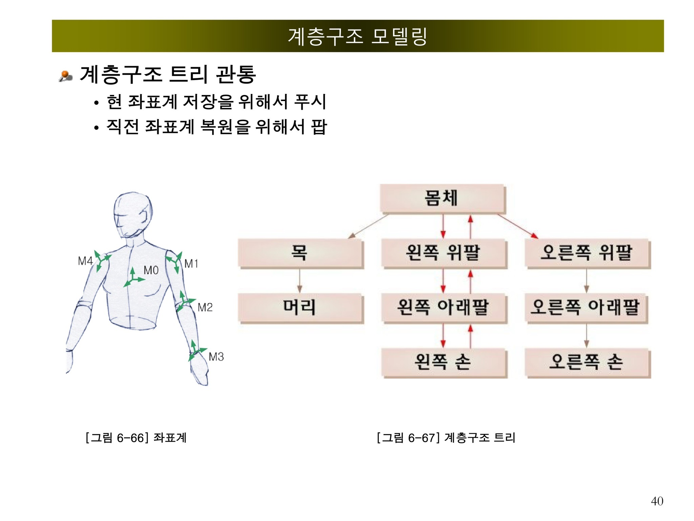
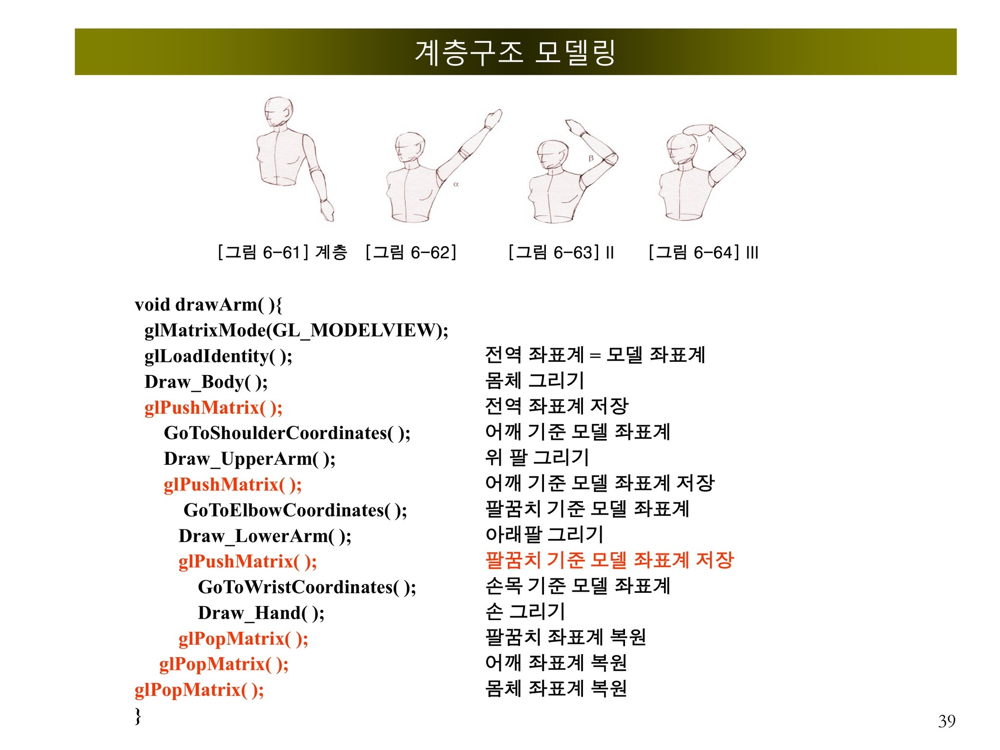

# 📌 Human Pose Generation (Hierarchical Modeling)

## 🗓️ Week
Week 6 (2026.04.07 ~ 2026.04.13)

## 📄 Submission
- Method: Online  
- Due Date: 2026.04.18 23:59  

---

## 📘 Overview

This project implements a **hierarchical modeling system** in OpenGL to generate and display a **human body pose**.

The goal is to understand how complex articulated models (like the human body) can be constructed using **parent-child relationships** and **transformation propagation**.

---

## 🧩 Hierarchical Structure

### 📌 Body Structure Tree

- The **body (torso)** acts as the root node
- Each body part (arms, head, hands) is a child node
- Transformations applied to a parent affect all its children

---

## ⚙️ Transformation Flow (Core Concept)

### 📌 OpenGL Matrix Stack Example

This structure demonstrates how hierarchical transformations are implemented using:

- `glPushMatrix()` → Save current coordinate system
- Apply transformation (shoulder → elbow → wrist)
- `glPopMatrix()` → Restore previous coordinate system

### 🔑 Key Idea

Each joint operates in its **own local coordinate system**,  
but is affected by its **parent transformations**.

---

## 🛠️ Implementation Details

### 1. Hierarchical Body Construction

- Each body part is modeled using primitives:
  - Sphere (joint)
  - Cylinder (limb)
  - Cube (torso)

- Transformations include:
  - Rotation (joint movement)
  - Translation (positioning)
  - Scaling (size adjustment)

- User input controls:
  - Shoulder rotation
  - Elbow rotation
  - Wrist rotation

---

### 2. Animation (Optional)

- Implement continuous motion:
  - Arm swinging
  - Walking motion

- Achieved by:
  - Updating rotation angles over time

---

### 3. Advanced Feature (Optional)

- Input: Target position (e.g., hand position)
- Output: Automatically adjusted joint angles

👉 Concept:
- Forward kinematics → basic movement
- Inverse kinematics → goal-based movement

---

## 🎯 Learning Objectives

- Understand **hierarchical modeling**
- Learn **matrix stack operations in OpenGL**
- Apply **local vs global coordinate systems**
- Explore **articulated motion systems**

---

## 💻 Tech Stack

- OpenGL
- GLUT
- C/C++

---

## 📎 Key Takeaways

- Hierarchical modeling is essential for:
  - Character animation
  - Robotics
  - Game development

- Correct use of:
  - `glPushMatrix()`
  - `glPopMatrix()`

👉 is critical to maintaining proper transformations

---

## 🚀 Future Improvements

- Implement full body animation (walking cycle)
- Add inverse kinematics for realistic motion
- Improve visual quality (lighting, shading)

---